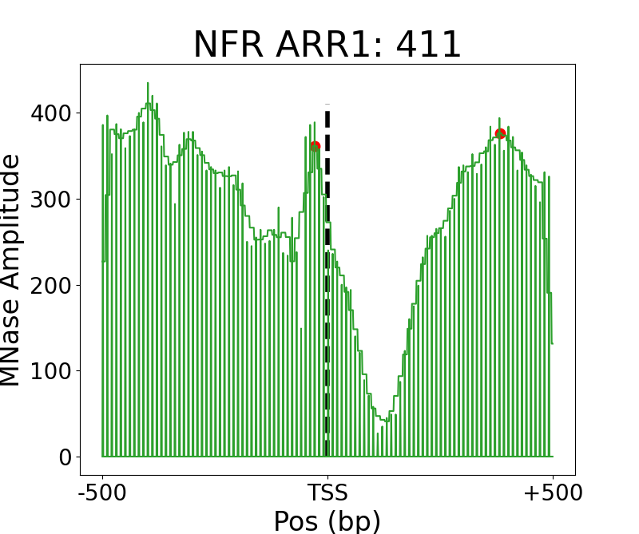
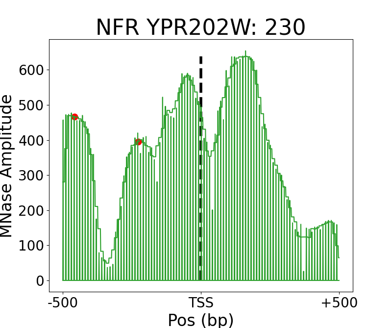
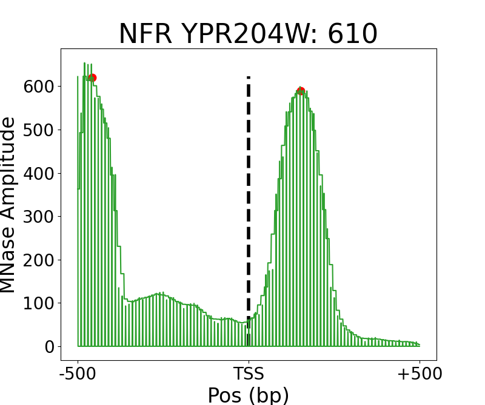

# Calculate Size of Nucleosome Free Regions (NFR)

[](https://zenodo.org/badge/latestdoi/475534080)

This command line tool provides an easy interface for calculating the size and depth of NFRs.
It is based on a simple algorithm that can be summarised as follows:

1) Take the TSS as a reference position. They are given by the passed `.bed` or `.gtf` file 
2) Consider a range around the TSS (`x_range`), fetch MNase data values, and smooth it. 
3) Calculate derivative and determine minima and maxima positions.
4) The position of the NFR is defined as the lowest local minima in the upstream region
5) The +1 and -1 nucleosome positions are subsequently defined by the maxima that sandwich the NFR
6) If there is a peak that is significantly larger (defined by  a threshold), then the nucleosome position is accordingly replaced

Alternatively, it is possible to automatically consider the +1 nucleosome as the closest peak to the TSS. The -1 nucleosome
is then said to be the first upstream peak. However, consider this calculation only if you trust the precision of your
annotation file. Also, it is assumed that the MNase-seq signal contains a lot of noise. If you have already filtered
your data by read length (e.g. between 130 and 200bp), then the results are more reliable when choosing the +1 nucleosome 
as reference, rather than the NFR. This is due to the fact that a large amount of the background signal is removed, and 
the detection of the NFR is not straightforward anymore.

If you experience that the program detects small wiggles as peaks, change the size of the smoothing window to a larger value.
If some important peaks are not detected, you can try to make it smaller. You can also change the `sig_nfold` flag. For more 
information see below.

The detection is considerably robust and detects the NTF even when the given TSS is not around the actual +1 nucleosome.

| |  | |
:-------------------------:|:-------------------------:|:-------------------------:
| |  


## Requirements
The program requires Python3, pip, and curl to be installed.

## Installation
Install the dependencies through

```commandline
python3 -m pip install -r requirements.txt
```

## Usage
The MNase signal should be converted to a bigwig `.bw` file. Gene annotations can be passed as a `.bed` por `.gtf` file.
NFR sizes are saved as a `.tsv` file together with the corresponding annotation names. 

```commandline
python3 nfr.py --bw=path/to/bw/file --annot=path/to/annotation [--smooth_ws=50 --sig_nfold=3 --mind_nfr=50 --maxd_total=500 --out_path=path/to/output/file --verbosity=0 --p1_tss --mind_nucl=150 --scale=1]
```

Parameters in brackets are optional.
- `--smooth_ws`: window size of smoothing window that is used for filtering the signal to decrease the impact of noise.
- `--sig_nfold`: nfold difference to initially computed position to consider another peak as actual +1/-1 nucleosome
- `--mind_nfr`: minimum difference from TSS to NFR
- `--maxd_total`: maximum distance from the TSS that is considered for finding +1/-1 nucleosome. Thus, the total window size is 2 * `maxd_total`
- `--out_path`: output directory
- `--verbosity`: verbosity flag to set amount of visualisation during execution. 
- `--p1_tss`: use the closest peak to the TSS to determine the +1 nucleosome. Computation does subsequently not rely anymore on the calculation of the NFR
- `--mind_nucl`: minimum distance between +1 and -1 nucleosome.
- `--scale`: Scale the smoothed signals. This can be used to adjust the comparability of the depth between different MNase signals. It can be also helpful if you're intending to plot your results (i.e. `verbosity > 3`)